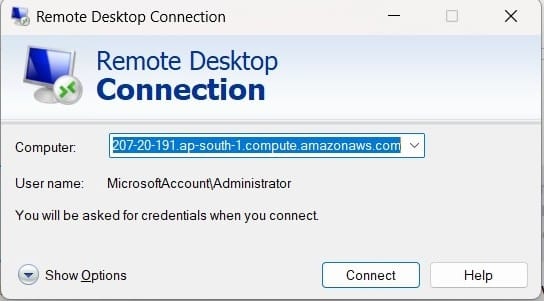
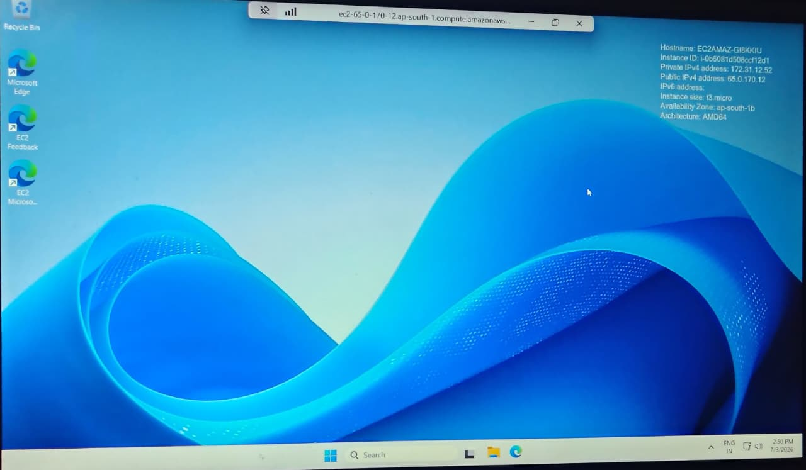
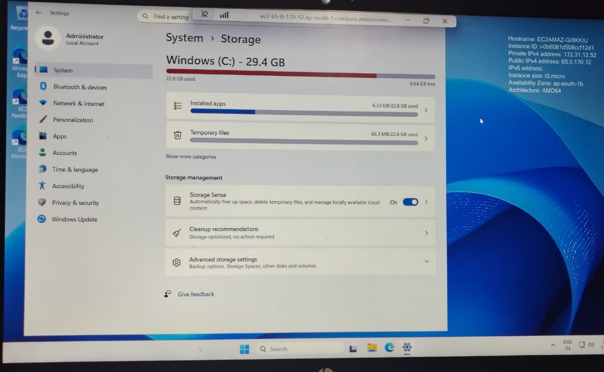

# AWS EC2 Practice

## Overview
This project demonstrates my hands-on practice with AWS EC2 (Elastic Compute Cloud).

## Outcome
Successfully launched and connected to a Windows EC2 instance using RDP and explored system configuration and storage.

## Topics Covered
- Launching EC2 Instance
- Connecting to Windows Instance using RDP
- Instance Configuration
- Storage Management
- Monitoring Instance Status

## Screenshots

### EC2 Instance Running

### RDP Connection

### Windows Desktop

### Storage Details

